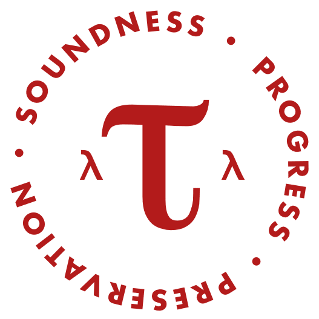

{{ course.days }}  
at {{ course.time }}  
in {{ course.room }}

### Instructor

[**Adrian Sampson**][adrian]  
<asampson@cs.cornell.edu>  
office hours: Monday and Friday at 11am (after class)  
in Gates 411A

### Teaching Assistants

[**Steffen Smolka**][steffen]  
<smolka@cs.cornell.edu>

**Daniel Sainati**  
<dhs253@cornell.edu>

[adrian]: http://www.cs.cornell.edu/~asampson/
[steffen]: http://www.cs.cornell.edu/~smolka/
